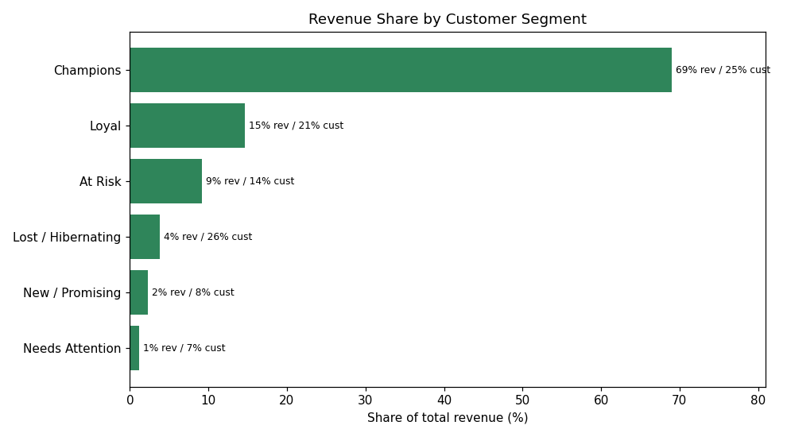
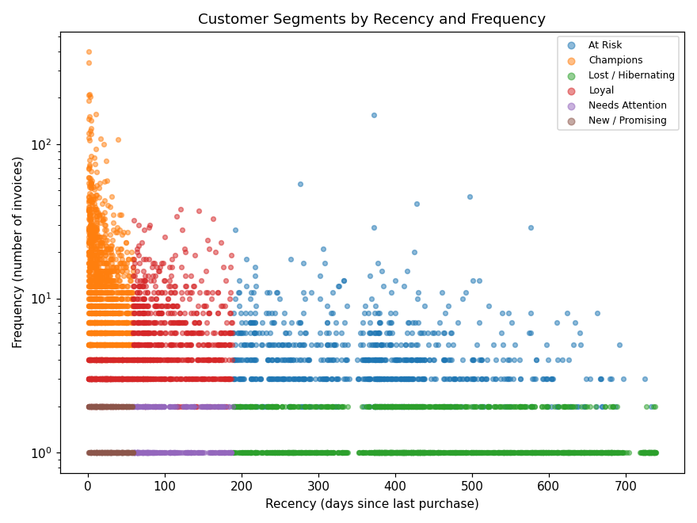
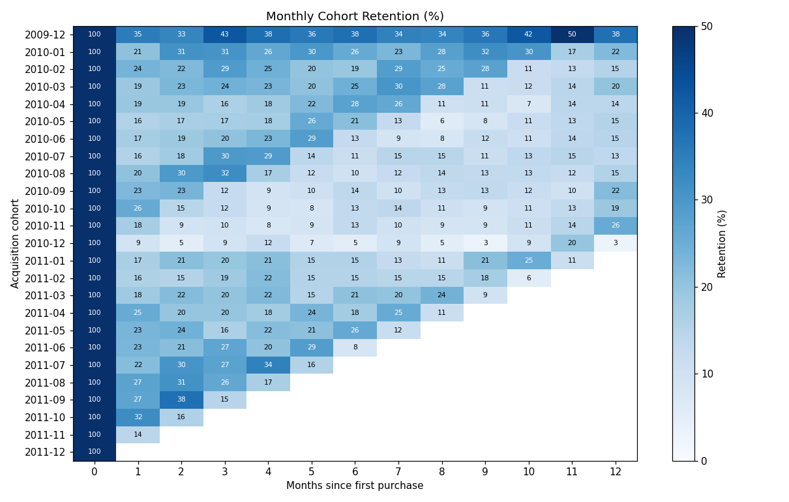
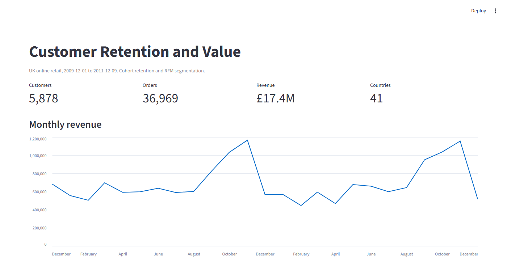

# Customer Retention and Value Analytics

How well does an online retailer keep its customers, and where does its revenue
actually come from? This project answers both questions from two years of real
UK transaction data, using cohort retention and RFM segmentation, with SQL
versions of the same logic and an interactive dashboard.

I built it to practise the kind of analysis a product or commercial team relies
on day to day: not just "how much did we sell" but "which customers matter, are
they staying, and who is slipping away".

## The data

Online Retail II from the UCI Machine Learning Repository: real transactions
from a UK based online retailer between December 2009 and December 2011. After
cleaning (removing cancellations, missing customer ids, and non positive
quantities or prices) the analysis covers:

* **779,425** transaction line items
* **5,878** customers across **41** countries
* **36,969** orders
* **£17.4M** total revenue

The raw file is downloaded separately; see [`data/README.md`](data/README.md).

## Headline findings

**A quarter of customers drive roughly two thirds of revenue.** The Champions
segment is 25 percent of customers but 69 percent of revenue. Protecting this
group is worth far more than a typical acquisition push.

**The business is acquisition heavy.** Average retention one month after the
first purchase is about 21 percent, and it stays near 18 percent a year later.
Most customers buy once and do not return, so the customers who do come back
are disproportionately valuable.

**There is a clear, costed retention opportunity.** The At Risk segment is 825
customers who used to buy often but have not purchased recently. They still
account for about £1.6M (9 percent) of revenue. Re-engaging them protects
existing revenue rather than chasing new customers.

### Segment summary

| Segment | Customers | Customer share | Revenue | Revenue share |
|---|---:|---:|---:|---:|
| Champions | 1,473 | 25.1% | £11.98M | 69.0% |
| Loyal | 1,229 | 20.9% | £2.55M | 14.7% |
| At Risk | 825 | 14.0% | £1.59M | 9.2% |
| Lost / Hibernating | 1,526 | 26.0% | £0.66M | 3.8% |
| New / Promising | 441 | 7.5% | £0.39M | 2.3% |
| Needs Attention | 384 | 6.5% | £0.20M | 1.2% |

<table>
  <tr>
    <td align="center"><br/><sub>Revenue share by segment</sub></td>
    <td align="center"><br/><sub>Segments by recency and frequency</sub></td>
  </tr>
  <tr>
    <td align="center" colspan="2"><br/><sub>Monthly cohort retention: each row is an acquisition month, each column is months since first purchase</sub></td>
  </tr>
</table>

## Method

### Cohort retention

Each customer is assigned to a cohort by the calendar month of their first
purchase. For every later month I measure the share of that cohort that bought
again. Reading across a row of the heatmap shows how a single intake of
customers decays over time; reading down a column compares the same month of
life across cohorts. This is the honest way to see retention, because it never
mixes new and old customers in a single average.

### RFM segmentation

For each customer I compute three numbers:

* **Recency**: days since their last purchase
* **Frequency**: number of distinct orders
* **Monetary**: total revenue

Each is scored 1 to 5 by quintile, and customers are grouped into business
readable segments (Champions, Loyal, At Risk, and so on) from their recency and
frequency scores. The point is to turn three continuous numbers into groups a
commercial team can actually act on.

## What I would recommend from this

* **Protect Champions.** They are a small group carrying most of the revenue, so
  a loyalty or early access programme aimed at them defends the core of the
  business.
* **Win back At Risk customers.** 825 previously frequent buyers worth £1.6M are
  cooling off. A targeted re-engagement offer is cheaper than replacing that
  revenue through acquisition.
* **Fix first to second purchase.** With month one retention near 20 percent,
  the largest leak is right after the first order. A welcome series or a second
  purchase incentive would lift the whole retention curve.

## My contribution

I did the full analysis workflow: cleaning the transaction data, building the
cohort retention logic, creating the RFM segmentation, writing SQL versions of
the main checks, producing the figures and turning the results into business
recommendations.

The main thing I wanted to show is that customer analytics should lead to a
decision. In this case, the strongest actions are protecting high value
customers, reactivating At Risk customers and improving the second purchase
journey.

## Interactive dashboard

`dashboard/app.py` is a Streamlit app that lets a non technical user explore the
same analysis: headline metrics, monthly revenue, the cohort retention heatmap
and the RFM segments, with a segment inspector at the bottom.

<p align="center">
  <br/>
  <sub>Headline metrics and monthly revenue</sub>
</p>

```bash
streamlit run dashboard/app.py
```

## Repository layout

```
customer-retention-rfm/
  README.md
  requirements.txt
  run_analysis.py            full pipeline: clean, analyse, save figures
  src/
    preprocessing.py         load and clean the transactions
    etl.py                   CLI: raw .xlsx to cleaned .parquet
    cohort.py                cohort retention matrix
    rfm.py                   RFM scoring and segmentation
    plotting.py              figures
  tests/                     pytest suite
  sql/
    01_create_tables.sql
    02_monthly_revenue.sql
    03_cohort_retention.sql  cohort retention in pure SQL
    04_rfm_segments.sql      RFM with NTILE and window functions
  dashboard/
    app.py                   Streamlit dashboard
  scripts/
    dashboard_screenshots.py optional, regenerates the README screenshot
  figures/                   generated by run_analysis.py
  data/                      dataset downloaded here (see data/README.md)
```

## How to run

```bash
pip install -r requirements.txt

# 1. download the data (see data/README.md), then
python run_analysis.py          # cleans, analyses, writes figures and tables

# 2. or just the cleaning step as a standalone ETL
python -m src.etl --input data/online_retail_II.xlsx \
                  --output data/online_retail_II_clean.parquet

# 3. explore interactively
streamlit run dashboard/app.py
```

The SQL files reproduce the monthly revenue, cohort retention and RFM
segmentation directly against a relational table, for the case where the data
lives in a warehouse rather than a spreadsheet.

## Tests

A small pytest suite covers the cleaning rules, the cohort retention maths and
the RFM scoring (including a regression test for tied recency values that used
to crash `pd.qcut`).

```bash
pytest tests/ -v
```

## Reproducibility

The numbers in this README come from a single run of `run_analysis.py` against
the file `data/online_retail_II.xlsx` downloaded from UCI. The pipeline is
deterministic: the only randomness would come from the model layer, and there
are no ML models here. Pinned versions are in `requirements.txt`. If you re-run
on the same workbook you should see the same headline counts (779,425 rows,
5,878 customers, GBP 17.4M revenue) to the last digit.

## Tech stack

Python, pandas, NumPy, Matplotlib, Streamlit, SQL.

## License

The project code is released under the MIT License. The dataset follows the
terms of the original UCI Machine Learning Repository source.
